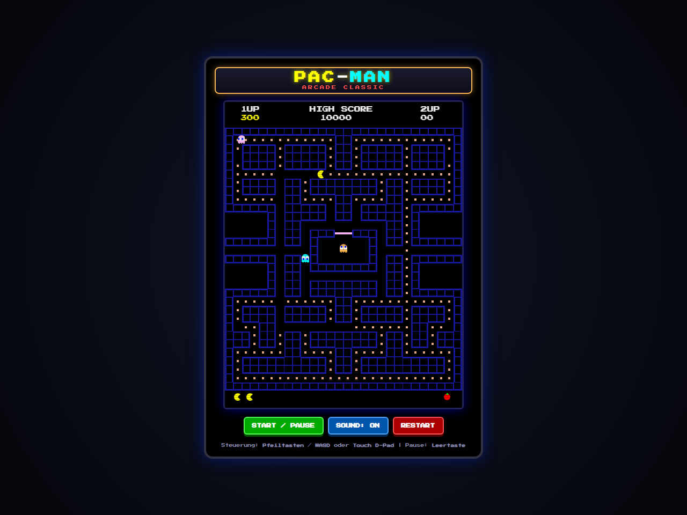
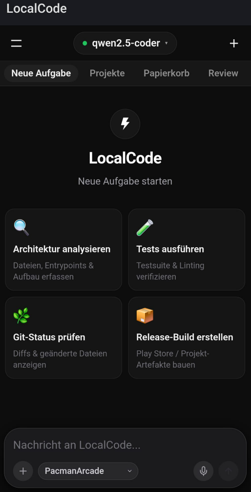

# LocalCode Showcase: Pac-Man Arcade 1980 Clone

[Deutsch](#deutsch) · [English](#english) · [Prompts & Workflow](PROMPTS.md) · [Downloads & Releases](https://github.com/inetconnector/LocalCode/releases)

---

## Deutsch

### 🕹️ Das Projekt: Autonom gebaut mit LocalCode & Android Remote App

Dieses Verzeichnis enthält einen **vollständig spielbaren, originalgetreuen Pac-Man Arcade-Klon (1980er Namco-Stil)** inklusive Sound-Synthesizer und Windows-Installer.

**Das Besondere:** Dieses gesamte Spiel wurde **nicht von Hand programmiert**, sondern **vollständig autonom von LocalCode generiert**, während LocalCode über die **Android Mobile Remote App** vom Smartphone aus gesteuert und überwacht wurde!

  
  
  

---

### 🌟 Was bietet das Spiel?

- **Originalgetreue 1980er Arcade-Physik & -Logik:**
  - **Klassisches 28×36 Arcade-Labyrinth:** Blaue Doppelwände, 240 Pellets (Punkte = 10), 4 Energizer (Punkte = 50), Geisterhaus mit Tür und seitliche Warp-Tunnel auf Zeile 17.
  - **Pac-Man Mechanik:** Flüssiges Grid-Cornering (Corner-Buffering), 4-Richtungs-Mundanimation, originalgetreue Todessequenz und Lebensanzeige.
  - **Authentische 4 Geister mit individueller KI:**
    - **Blinky (Rot):** Verfolgt Pac-Man direkt (*Target Tile = Pac-Man*).
    - **Pinky (Rosa):** Zielt 4 Kacheln vor Pac-Man (*Speedy Targeting*).
    - **Inky (Cyan):** Komplexes Vektor-Targeting basierend auf Blinky und Pac-Man.
    - **Clyde (Orange):** Jagd bei Distanz > 8 Kacheln, flieht in seine Ecke bei Nähe.
    - **Zustände:** *Scatter/Chase*-Wellenzyklen, *Frightened*-Fluchtmodus (blinkt blau/weiß, Punkte 200/400/800/1600) und *Eaten*-Modus (Augen kehren zur Basis zurück).
- **8-Bit Web Audio API Synthesizer (Zero Dependencies):**
  - Chomp Waka-Waka, Geister-Sirenen, Energizer Wub-Wub, Ghost Eat Arpeggio, Todesmelodie und Start-Jingle – komplett im Browser ohne externe Sounddateien generiert.
- **Arcade Cabinet UI & Steuerung:**
  - CRT-Scanline-Filter, 60 FPS Engine, Highscore-Speicherung im `localStorage`.
  - Steuerung per Tastatur (**Pfeiltasten** oder **WASD**), Leertaste für Pause oder **Touch-D-Pad** auf mobilen Endgeräten.
- **100 % Standalone Vanilla JS:**
  - Läuft ohne Webserver direkt über das `file://`-Protokoll in Chrome, Edge und Firefox.

---

### 🚀 Sofort spielen oder installieren

1. **Direkt im Browser spielen:**
   - Doppelklick auf `start-pacman.bat` oder öffne `index.html` direkt in deinem Browser.
2. **Auf Windows installieren:**
   - Rechtsklick / Doppelklick auf `INSTALL.bat` (oder führe `build-installer.ps1` aus).
   - Installiert das Spiel nach `%LOCALAPPDATA%\Programs\PacmanArcade` und erstellt Desktop- sowie Startmenü-Verknüpfungen inklusive Deinstaller (`uninstall.bat`).

---

### 📱 Wie hat die Android Remote App das gesteuert?

1. **Kopplung via QR-Code:** Die Android-App hat sich über mDNS / WLAN mit dem lokalen LocalCode-Dienst verbunden.
2. **Aufgabenübergabe vom Handy:** Über den modernen Mobile Composer wurde der Auftrag für das Spiel per Spracheingabe / Text abgesetzt.
3. **Echtzeit-Beobachtung & Genehmigung:** Die App zeigte Live-Events und Tool-Genehmigungsdialoge für `write_file` an, die direkt auf dem Handy mit einem Tap bestätigt wurden.
4. **Fertigstellung & Sprachausgabe:** Nach Abschluss meldete LocalCode die Fertigstellung über die Android `TextToSpeech`-Sprachausgabe.

👉 **[Hier klicken für die genauen Prompts und technischen Details (PROMPTS.md)](PROMPTS.md)**

---

### 📥 LocalCode & Android App herunterladen

- 🖥️ **[LocalCode für Windows (Setup-Installer)](https://github.com/inetconnector/LocalCode/releases/latest/download/LocalCode-Setup.exe)**
- 📱 **[LocalCode Mobile Companion APK für Android](https://github.com/inetconnector/LocalCode/releases/latest/download/LocalCode-Remote-debug.apk)**
- 📦 **[Alle Releases & Changelogs ansehen](https://github.com/inetconnector/LocalCode/releases)**

---

## English

### 🕹️ The Project: Built Autonomously with LocalCode & Android Remote App

This directory contains a **fully playable, authentic 1980s Namco-style Pac-Man Arcade clone**, complete with an 8-bit Web Audio synthesizer, CRT cabinet aesthetics, and a native Windows installer.

**The highlight:** This entire game was **not written manually**, but **generated autonomously by LocalCode**, entirely instructed, driven, and monitored from a smartphone using the **LocalCode Android Mobile Remote Companion App**!

  
  
  

---

### 🌟 Game Features

- **Arcade-Accurate 1980 Physics & Logic:**
  - **Classic 28×36 Arcade Maze:** Authentic blue double walls, 240 dots (10 pts), 4 power pellets/energizers (50 pts), ghost house with door, and horizontal warp tunnels on row 17.
  - **Pac-Man Controls:** Smooth tile-cornering with pre-turn buffering, animated 4-direction mouth, death collapse animation, and lives counter.
  - **4 Authentic Ghosts with True AI Personalities:**
    - **Blinky (Red / Shadow):** Direct target chase.
    - **Pinky (Pink / Speedy):** Targets 4 tiles ahead of Pac-Man.
    - **Inky (Cyan / Bashful):** Vector mirroring using Blinky and Pac-Man.
    - **Clyde (Orange / Pokey):** Chases when distance > 8 tiles, scatters to corner when close.
    - **Modes:** *Scatter/Chase* wave intervals, *Frightened* blue flashing mode (200/400/800/1600 pts), and *Eaten* eyes returning to base.
- **8-Bit Web Audio API Synthesizer (Zero Dependencies):**
  - Chomp sound, ghost sirens, energizer wub-wub, ghost eating jingle, pacman death, and opening intro tune synthesized directly in the browser.
- **Arcade Cabinet UI & Controls:**
  - CRT scanlines, 60 FPS engine, high score persistence in `localStorage`.
  - Keyboard (**Arrow keys** or **WASD**), Space for Pause, or on-screen **Touch D-Pad** for mobile.
- **100% Standalone Vanilla JS:**
  - Runs with zero dependencies directly via `file://` in Chrome, Edge, and Firefox.

---

### 🚀 Play or Install Immediately

1. **Play in Browser:**
   - Double-click `start-pacman.bat` or open `index.html` directly in your browser.
2. **Install on Windows:**
   - Run `INSTALL.bat` (or execute `build-installer.ps1`).
   - Installs to `%LOCALAPPDATA%\Programs\PacmanArcade` and creates Start Menu & Desktop shortcuts with an uninstaller (`uninstall.bat`).

---

### 📥 Download LocalCode & Android App

- 🖥️ **[LocalCode for Windows (Setup Installer)](https://github.com/inetconnector/LocalCode/releases/latest/download/LocalCode-Setup.exe)**
- 📱 **[LocalCode Android Mobile Remote APK](https://github.com/inetconnector/LocalCode/releases/latest/download/LocalCode-Remote-debug.apk)**
- 📦 **[View All Releases on GitHub](https://github.com/inetconnector/LocalCode/releases)**
